---
## Front matter
lang: ru-RU
title: Лабораторная работа №10
subtitle: "Программирование в командном
процессоре ОС UNIX. Командные файлы"
author:
  - Салькова К. М.
institute:
  - Российский университет дружбы народов, Москва, Россия

## i18n babel
babel-lang: russian
babel-otherlangs: english

## Formatting pdf
toc: false
toc-title: Содержание
slide_level: 2
aspectratio: 169
section-titles: true
theme: metropolis
header-includes:
 - \metroset{progressbar=frametitle,sectionpage=progressbar,numbering=fraction}
 - '\makeatletter'
 - '\beamer@ignorenonframefalse'
 - '\makeatother'
---

# Информация

## Докладчик

:::::::::::::: {.columns align=center}
::: {.column width="70%"}

  * Салькова Кристина Михайловна
  * студентка НБИбд-04-22
  * Российский университет дружбы народов

:::
::: {.column width="30%"}

:::
::::::::::::::

# Вводная часть

## Объект и предмет исследования

- командный процессор OC UNIX

## Задание

- Написать скрипт, который при запуске будет делать резервную копию самого себя
- Написать пример командного файла, обрабатывающего любое произвольное число
аргументов командной строки
- Написать командный файл — аналог команды ls
- Написать командный файл, который получает в качестве аргумента командной строки
формат файла и вычисляет количество таких файлов
в указанной директории

# Цель работы

## Цель работы

Изучить основы программирования в оболочке ОС UNIX/Linux. Научиться писать
небольшие командные файлы

# Выполнение лабораторной работы

## Задание 1

1. Написать скрипт, который при запуске будет делать резервную копию самого себя (то
есть файла, в котором содержится его исходный код) в другую директорию backup
в вашем домашнем каталоге. При этом файл должен архивироваться одним из ар-
хиваторов на выбор zip, bzip2 или tar. Способ использования команд архивации
необходимо узнать, изучив справку.

## Создание файла формат sh 

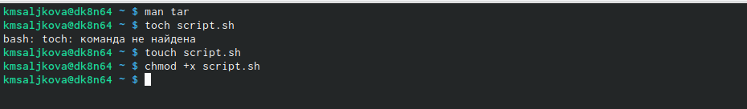{#fig:001 width=50%}

## Cкрипт1

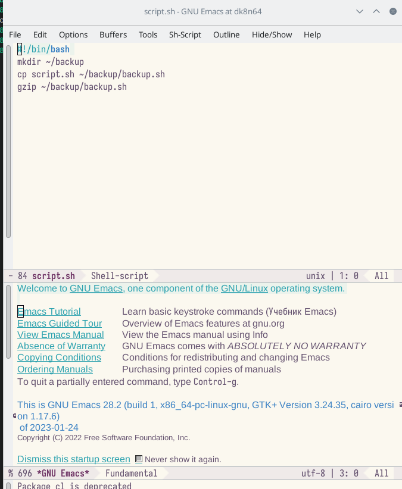{#fig:001 width=50%}

## Проверка

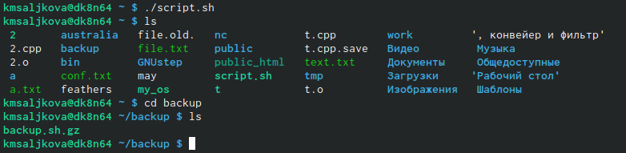{#fig:001 width=50%}

## Задание 2

2. Написать пример командного файла, обрабатывающего любое произвольное число
аргументов командной строки, в том числе превышающее десять. Например, скрипт
может последовательно распечатывать значения всех переданных аргументов.

## Создание файла2 формат sh 

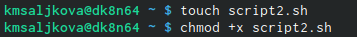{#fig:001 width=50%}

## Cкрипт2

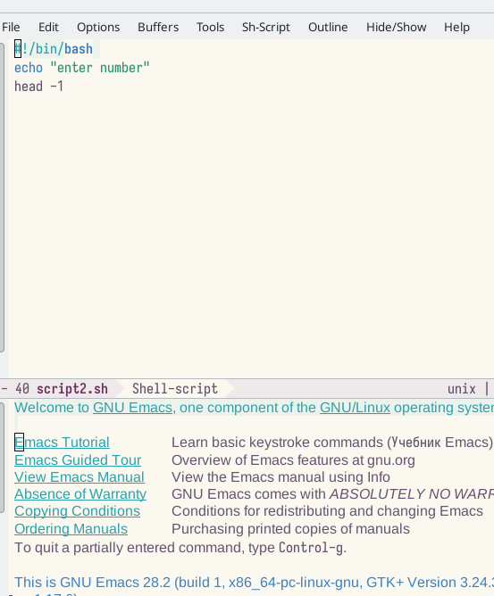{#fig:001 width=50%}

## Проверка

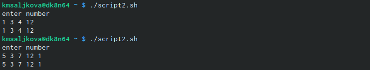{#fig:001 width=50%}

## Задание 3

3. Написать командный файл — аналог команды ls (без использования самой этой ко-
манды и команды dir). Требуется, чтобы он выдавал информацию о нужном каталоге
и выводил информацию о возможностях доступа к файлам этого каталога.

## Создание файла3 формат sh 

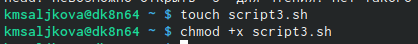{#fig:001 width=50%}

## Cкрипт3

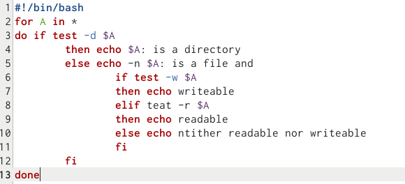{#fig:001 width=50%}

## Проверка

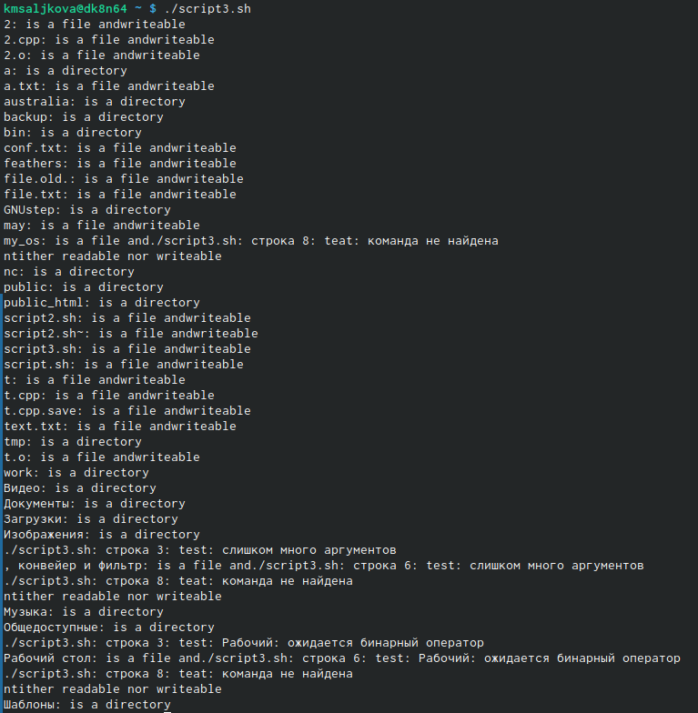{#fig:001 width=50%}

## Задание 4

4. Написать командный файл, который получает в качестве аргумента командной строки
формат файла (.txt, .doc, .jpg, .pdf и т.д.) и вычисляет количество таких файлов
в указанной директории. Путь к директории также передаётся в виде аргумента ко-
мандной строки

## Создание файла4 формат sh 

{#fig:001 width=50%}

## Cкрипт4

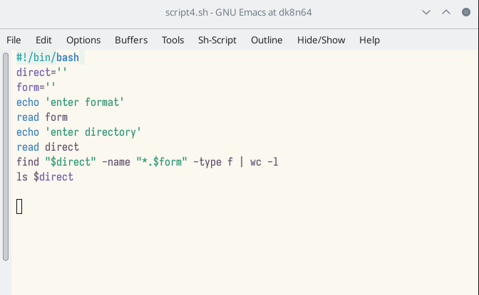{#fig:001 width=50%}

## Проверка

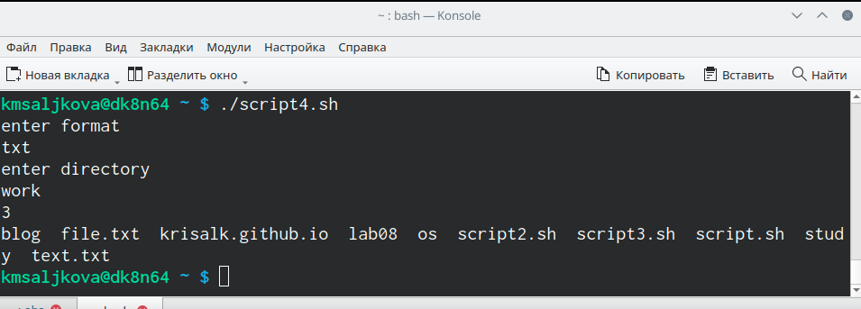{#fig:001 width=50%}

# Вывод

## Выводы

Мы изучили основы программирования в оболочке ОС UNIX/Linux и научились писать
небольшие командные файлы

::: incremental

:::

