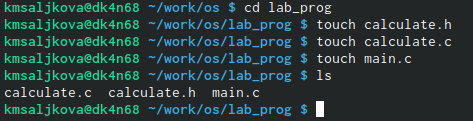
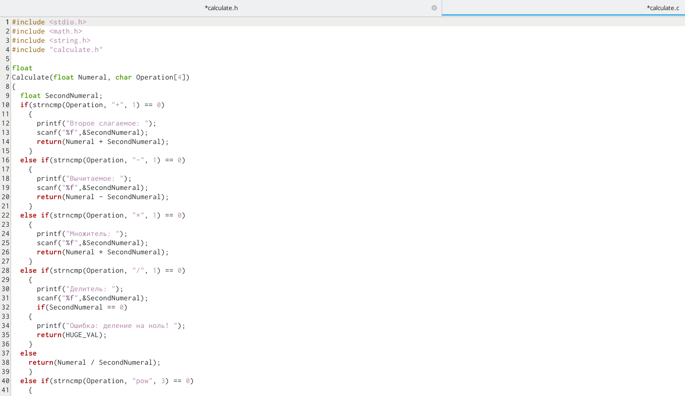
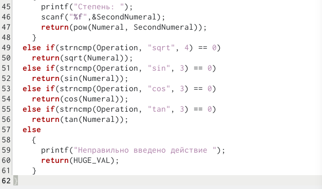
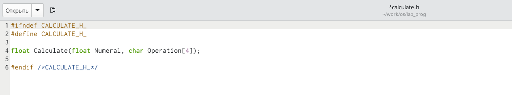
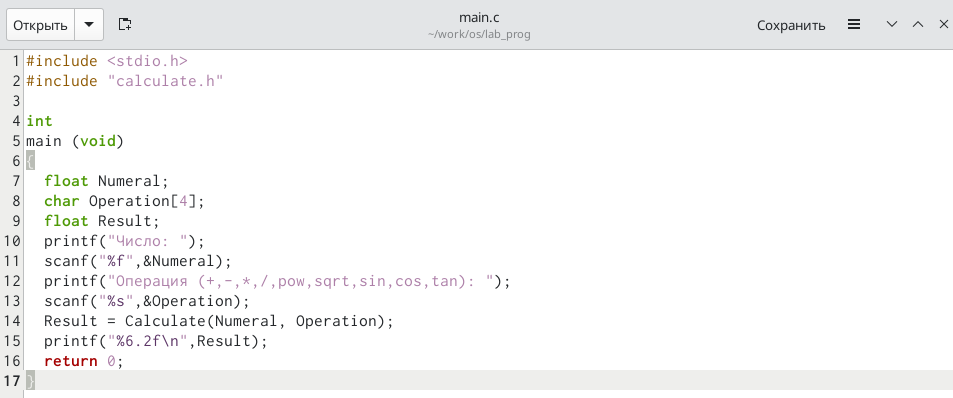
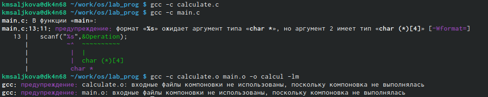
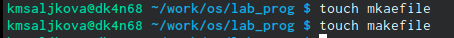
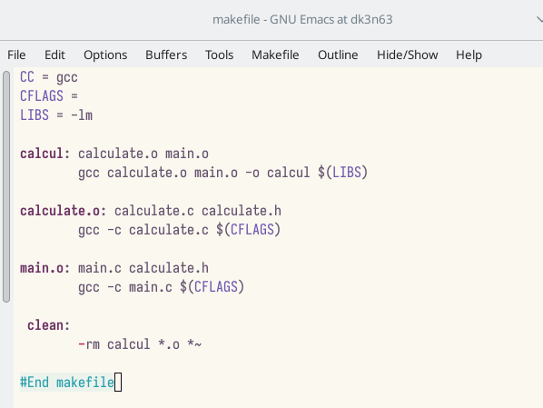
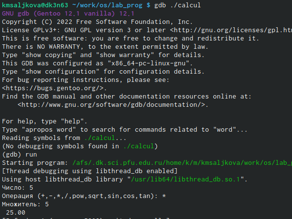

---
## Front matter
lang: ru-RU
title: Лабораторная работа №13
subtitle: "Средства, применяемые при
разработке программного обеспечения в ОС типа UNIX/Linux"
author:
  - Салькова К. М.
institute:
  - Российский университет дружбы народов, Москва, Россия

## i18n babel
babel-lang: russian
babel-otherlangs: english

## Formatting pdf
toc: false
toc-title: Содержание
slide_level: 2
aspectratio: 169
section-titles: true
theme: metropolis
header-includes:
 - \metroset{progressbar=frametitle,sectionpage=progressbar,numbering=fraction}
 - '\makeatletter'
 - '\beamer@ignorenonframefalse'
 - '\makeatother'
---

# Информация

## Докладчик

:::::::::::::: {.columns align=center}
::: {.column width="70%"}

  * Салькова Кристина Михайловна
  * студентка НБИбд-04-22
  * Российский университет дружбы народов

:::
::: {.column width="30%"}

:::
::::::::::::::

# Вводная часть

## Объект и предмет исследования

- командный процессор OC UNIX

## Задание

1. Используя команды getopts grep, написать командный файл, который анализирует
1. В домашнем каталоге создайте подкаталог ~/work/os/lab_prog.
2. Создайте в нём файлы: calculate.h, calculate.c, main.c.
Это будет примитивнейший калькулятор, способный складывать, вычитать, умножать
и делить, возводить число в степень, брать квадратный корень, вычислять sin, cos, tan.
При запуске он будет запрашивать первое число, операцию, второе число. После этого
программа выведет результат и остановится.
- Реализация функций калькулятора в файле calculate.c
- Интерфейсный файл calculate.h, описывающий формат вызова функции-
калькулятора
- Основной файл main.c, реализующий интерфейс пользователя к калькулятору
3. Выполните компиляцию программы посредством gcc
4. При необходимости исправьте синтаксические ошибки.
5. Создайте Makefile со следующим содержанием
6. С помощью gdb выполните отладку программы calcul (перед использованием gdb
исправьте Makefile):
- Запустите отладчик GDB, загрузив в него программу для отладки

# Цель работы

## Цель работы

Приобрести простейшие навыки разработки, анализа, тестирования и отладки при-
ложений в ОС типа UNIX/Linux на примере создания на языке программирования
С калькулятора с простейшими функциями.

# Выполнение лабораторной работы

## Задание 1

 В домашнем каталоге создадим подкаталог ~/work/os/lab_prog. 

{#fig:001 width=50%}

## Задание 2

Создайте в нём файлы: calculate.h, calculate.c, main.c.

{#fig:001 width=50%} 

## 2.1

Реализация функций калькулятора в файле calculate.c

{#fig:001 width=50%}

##

{#fig:001 width=50%}

## 2.2

Интерфейсный файл calculate.h, описывающий формат вызова функции-
калькулятора

{#fig:001 width=50%}

## 2.3 

Основной файл main.c, реализующий интерфейс пользователя к калькулятору

{#fig:001 width=50%}

## Задание 3

 Выполните компиляцию программы посредством gcc

{#fig:001 width=50%}

## Задание 4

 Видим, что существуют некоторые ошибки и исправляем их

## Задание 5

 Создадим Makefile

{#fig:001 width=50%}

## Задание 6

 Исправление makefile

{#fig:001 width=50%}

## Задание 7

- С помощью gdb выполним отладку программы calcul 
- Запустите отладчик GDB, загрузив в него программу для отладки

{#fig:001 width=50%}

# Вывод

## Выводы

Мы приобрели простейшие навыки разработки, анализа, тестирования и отладки при-
ложений в ОС типа UNIX/Linux на примере создания на языке программирования
С калькулятора с простейшими функциями.

::: incremental

:::

