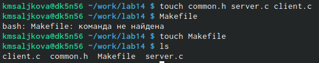
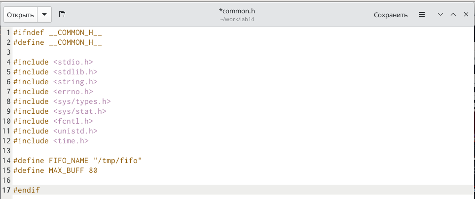
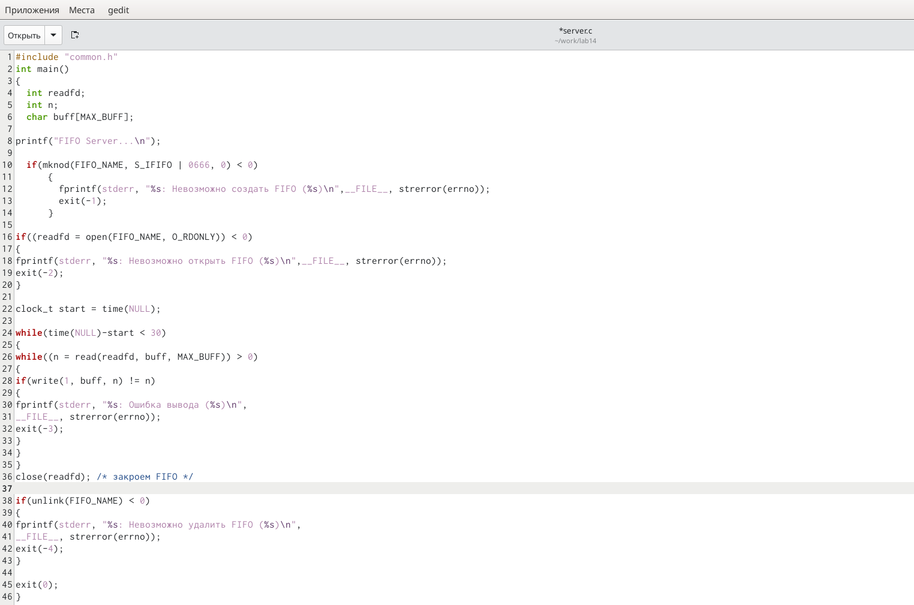
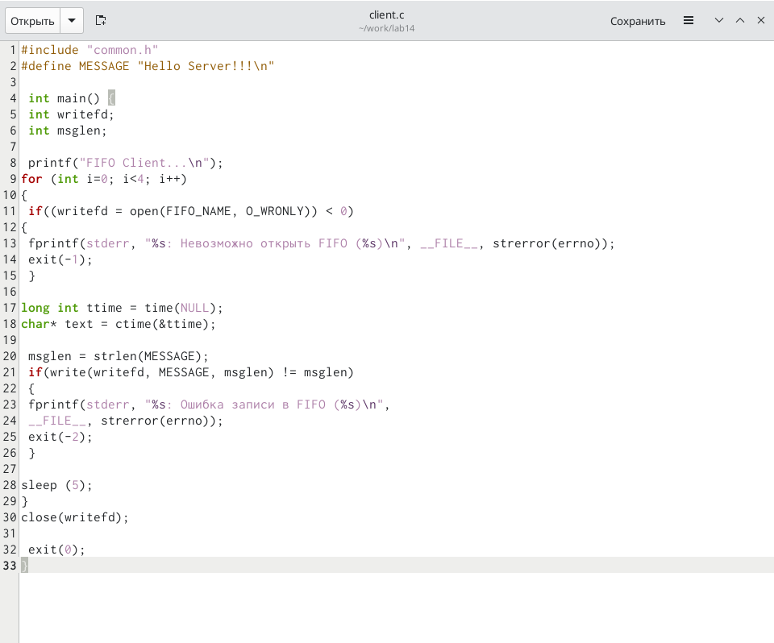
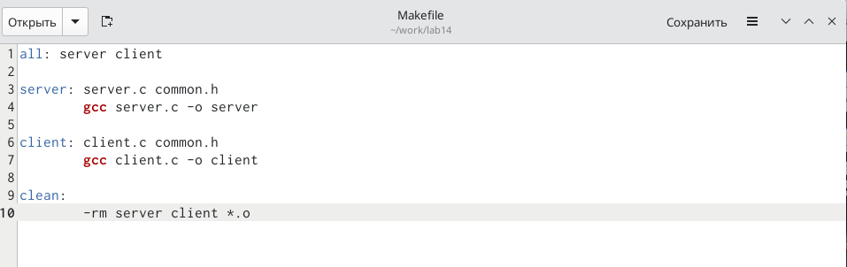
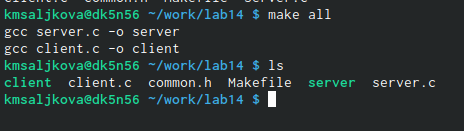
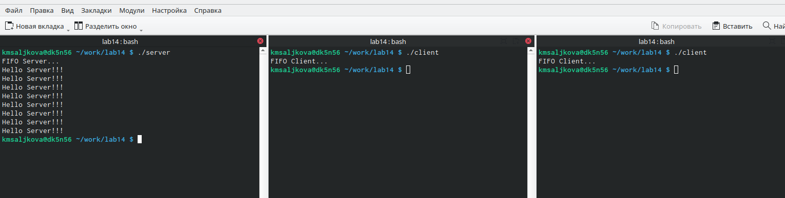

---
## Front matter
lang: ru-RU
title: Лабораторная работа №14
subtitle: "Именованные каналы"
author:
  - Салькова К. М.
institute:
  - Российский университет дружбы народов, Москва, Россия

## i18n babel
babel-lang: russian
babel-otherlangs: english

## Formatting pdf
toc: false
toc-title: Содержание
slide_level: 2
aspectratio: 169
section-titles: true
theme: metropolis
header-includes:
 - \metroset{progressbar=frametitle,sectionpage=progressbar,numbering=fraction}
 - '\makeatletter'
 - '\beamer@ignorenonframefalse'
 - '\makeatother'
---

# Информация

## Докладчик

:::::::::::::: {.columns align=center}
::: {.column width="70%"}

  * Салькова Кристина Михайловна
  * студентка НБИбд-04-22
  * Российский университет дружбы народов

:::
::: {.column width="30%"}

:::
::::::::::::::

# Вводная часть

## Объект и предмет исследования

- командный процессор OC UNIX

## Задание

Изучите приведённые в тексте программы server.c и client.c. Взяв данные примеры
за образец, напишите аналогичные программы, внеся следующие изменения:

1. Работает не 1 клиент, а несколько (например, два).

2. Клиенты передают текущее время с некоторой периодичностью (например, раз в пять
секунд). Используйте функцию sleep() для приостановки работы клиента.

3. Сервер работает не бесконечно, а прекращает работу через некоторое время (напри-
мер, 30 сек). Используйте функцию clock() для определения времени работы сервера.
Что будет в случае, если сервер завершит работу, не закрыв канал?

# Цель работы

## Цель работы

Приобретение практических навыков работы с именованными каналами.

# Выполнение лабораторной работы

## Задание 1

1. Создадим необходимые файлы с помощью команды «touch common.h server.c client.c Makefile» и отредактируем их

{#fig:001 width=50%}

## Задание 2

Далее меняем коды программ, представленных в тексте лабораторной работы.

## 2.1

В файл common.h добавим стандартные заголовочные файлы unistd.h и time.h, необходимые для работы кодов других файлов. Common.h предназначен для заголовочных файлов, чтобы в остальных программах их не прописывать каждый раз

##

{#fig:001 width=50%}

## 2.2

 В файл server.c добавим цикл while для контроля за временем работы сервера. Разница между текущим временем time(NULL) и временем начала работы clock_t start=time(NULL) (инициализация до цикла) не должна превышать 30 секунд(рис

##

{#fig:001 width=50%}

## 2.3 
 
 В файл client.c добавим цикл, который отвечает за количество сообщений о текущем времени (4 сообщения), которое получается в результате выполнения команд, и команду sleep(5) для приостановки работы клиента на 5 секунд.

##

{#fig:001 width=50%}

##

 Makefile (файл для сборки) не изменяем

{#fig:001 width=50%}

## Задание 3

 После написания кодов,используя команду «make all», скомпилируем необходимые файлы

{#fig:001 width=50%}

## Задание 4 - проверим работу написанного кода.

Откроем 3 консоли (терминала) и запустил: в первом терминале − «./server», в остальных двух – «./client». В результате каждый терминал-клиент вывел по 4 сообщения. Спустя 30 секунд работа сервера была прекращена. Программа работает корректно

{#fig:001 width=50%}

# Вывод

## Выводы

Мы приобрели практические навыки работы с именованными каналами.

::: incremental

:::

